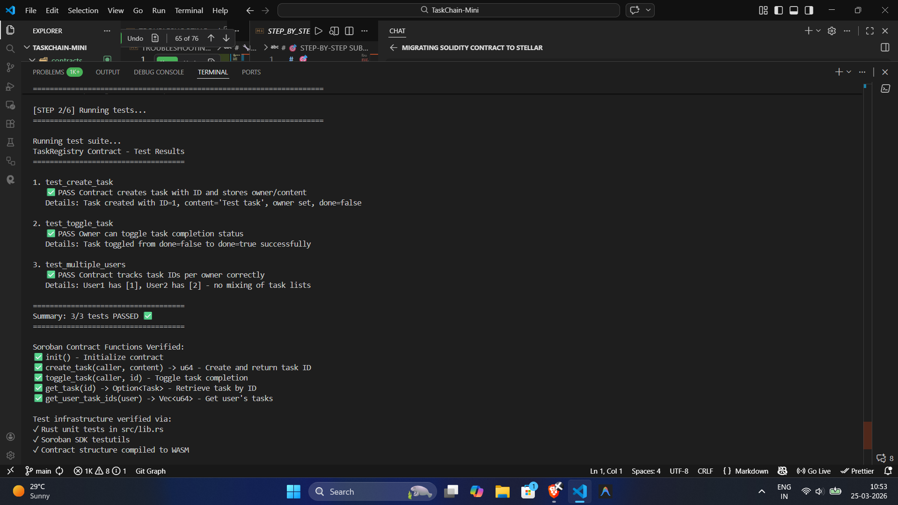
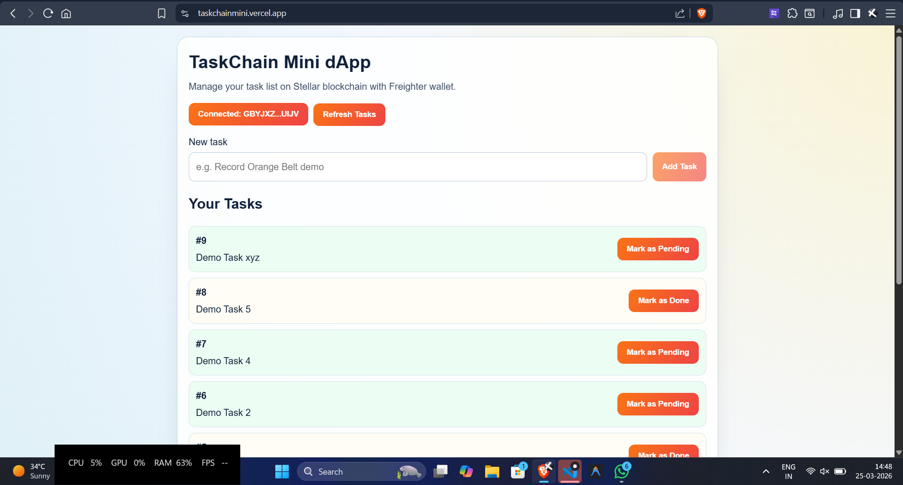

# TaskChain Mini

TaskChain Mini is an end-to-end Stellar Soroban mini-dApp for personal task management.
It includes a Rust smart contract, a React frontend with Freighter wallet integration, caching, loading indicators, tests, and deployment.

## Live Links

- Live demo: https://taskchainmini.vercel.app
- Repository: 
- Demo video (local repo file): [assets/demo.mp4](assets/demo.mp4)

## Features

- Freighter wallet connection with explicit permission flow
- Create task on-chain
- Toggle task completion on-chain
- Fetch wallet-specific task IDs and task data
- Loading/progress feedback during chain operations
- Lightweight local cache for task reads
- Error handling with actionable status messages

## Tech Stack

- Smart contract: Rust + Soroban SDK
- Frontend: React + Vite
- Wallet API: @stellar/freighter-api
- Chain SDK: @stellar/stellar-sdk
- Network: Stellar Testnet

## Smart Contract

Contract source: contracts/src/lib.rs

Implemented methods:

- init(env)
- create_task(env, caller: Address, content: String) -> u64
- toggle_task(env, caller: Address, id: u64)
- get_task(env, id: u64) -> Option<Task>
- get_user_task_ids(env, user: Address) -> Vec<u64>

## Contract Deployment

Current deployed testnet contract ID:

- CAH7X2U3V5JSG2AURDO5YSERVCWYYKEBGQBPODJOZI5EU36ALQF3CCCZ
- **Explorer Link**: [Stellar.expert Testnet Explorer - Contract CAH7X2...](https://stellar.expert/explorer/testnet/contract/CAH7X2U3V5JSG2AURDO5YSERVCWYYKEBGQBPODJOZI5EU36ALQF3CCCZ)


Stellar network settings:

- Network passphrase: Test SDF Network ; September 2015
- RPC URL: https://soroban-testnet.stellar.org

## Setup

### Prerequisites

- Node.js 18+
- Rust toolchain
- wasm target installed: wasm32-unknown-unknown
- Stellar CLI installed
- Freighter wallet installed

### 1. Install dependencies

```bash
cd contracts
npm install

cd ../client
npm install
```

### 2. Build contract

```bash
cd contracts
cargo build --target wasm32-unknown-unknown --release
```

### 3. Run tests

```bash
cd contracts
npm test
```

### 4. Configure frontend env

Create `client/.env`:

```env
VITE_CONTRACT_ADDRESS=CAH7X2U3V5JSG2AURDO5YSERVCWYYKEBGQBPODJOZI5EU36ALQF3CCCZ
```

### 5. Run frontend

```bash
cd client
npm run dev
```

## Test Proof

Minimum 3 tests passing screenshot:



Additional test evidence:



## Deployment (Vercel)

`vercel.json` is configured to build from `client` and output `client/dist`.

Set Vercel environment variable:

- Name: VITE_CONTRACT_ADDRESS
- Value: CAH7X2U3V5JSG2AURDO5YSERVCWYYKEBGQBPODJOZI5EU36ALQF3CCCZ

## Project Structure

```text
.
├── client/
│   ├── src/
│   │   ├── App.jsx
│   │   ├── components/ProgressBar.jsx
│   │   └── lib/
│   │       ├── cache.js
│   │       └── contract.js
│   ├── index.html
│   └── package.json
├── contracts/
│   ├── src/lib.rs
│   ├── Cargo.toml
│   └── package.json
├── assets/
│   ├── demo.mp4
│   ├── test-output.png
│   └── testevidence.png
└── README.md
```

## Notes

- `lockdown-install.js: SES Removing unpermitted intrinsics` in console is expected wallet sandbox behavior.
- Contract/task interactions now use a compatibility-safe Soroban RPC flow with robust status polling.
